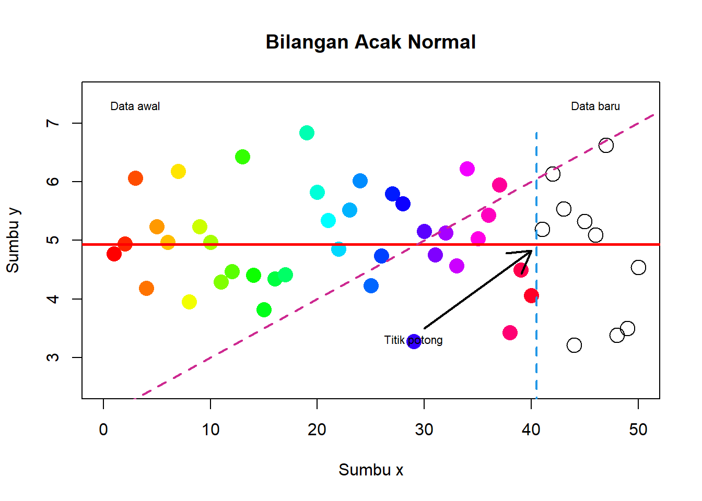
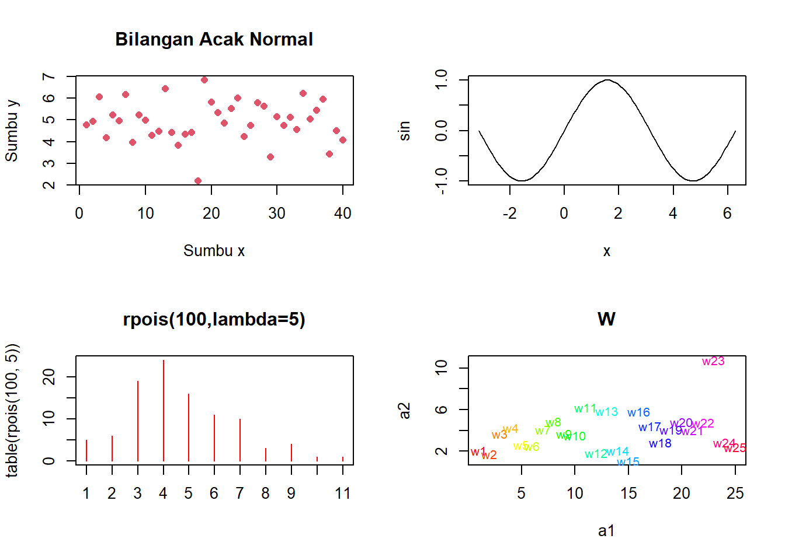
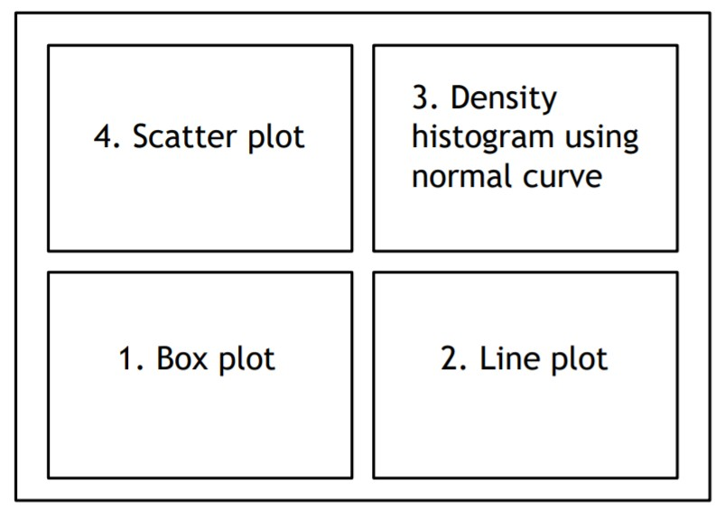

# Visualisasi Data


```{r, include=FALSE}
options(scipen = 999)
knitr::opts_chunk$set(message = FALSE, warning = FALSE)
```

Salah satu keunggulan R dibandingkan dengan *software* statistika lainnya adalah kemampuan menghasilkan grafik yang sangat mumpuni, baik untuk membuat plot untuk eksplorasi data awal, validasi model, atau untuk keperluan publikasi. Setidaknya ada tiga sistem utama untuk menghasilkan grafik dalam R yaitu grafik R dasar (*base R graphics*), `lattice` dan `ggplot2`. Masing-masing sistem ini memiliki kekuatan dan kelemahannya masing-masing. Pada kesempatan ini, kita akan lebih fokus pada grafik R dasar dan ggplot2.

Untuk keperluan praktik pembuatan grafik, kita akan menggunakan salah satu dari data "NYS Salary Information for the Public Sector" yang dapat diperoleh di laman [kaggle](https://www.kaggle.com/new-york-state/nys-salary-information-for-the-public-sector/), di samping data-data lainnya. Untuk memudahkan proses latihan, data telah saya olah terlebih dahulu dengan perintah berikut

```{r, eval=FALSE, warning=FALSE}
library(dplyr)

read.csv("data/salary-information-for-local-authorities.csv") %>%
  filter(Has.Employees != 'No') %>%
  mutate(Employee.Group = substr(Employee.Group.End.Date, 1, 4),
         Other.Allowances = Overtime.Paid + 
           Performance.Bonus + 
           Extra.Pay + 
           Other.Compensation ) %>%
  mutate_all(na_if, "") %>%
  select(Authority.Name, Employee.Group, Title, Group, Department, Pay.Type, 
         Exempt.Indicator, Base.Annualized.Salary, Actual.Salary.Paid,
         Other.Allowances, Total.Compensation, Paid.By.Another.Entity,
         Paid.by.State.or.Local.Government ) %>%
  saveRDS("data/salary.rds")
```

```{r}
library(dplyr)

Salary <- readRDS("data/salary.rds")
glimpse(Salary)
```

## Grafik R dasar


### Histogram

Membuat histogram dapat dilakukan dengan fungsi `hist()`

```{r}
hist(Salary$Actual.Salary.Paid)
```

```{r}
hist(Salary$Actual.Salary.Paid, freq = FALSE)
```


```{r}
hist(Salary$Actual.Salary.Paid, freq = FALSE, breaks = 50)
```


```{r}
plot(density(Salary$Actual.Salary.Paid, bw = 0.5))
```

### Bar plot

```{r}
counts <- table(Salary$Employee.Group)
counts 
```

```{r}
barplot(counts)
```


```{r}
barplot(counts, cex.names=.8)
```

```{r}
counts <- table(Salary$Pay.Type, Salary$Employee.Group)
barplot(counts, cex.names=.8)
```

```{r}
barplot(counts,
        col = c("#ffd166","#06d6a0"), #custom colors
        legend = rownames(counts),
        cex.names=.8)
```

```{r}
barplot(counts,
        col = c("#ffd166","#06d6a0"),
        legend = rownames(counts),
        beside = TRUE,
        cex.names=.8)
```

### Scatter plot

```{r}
x = seq(from = -2*pi, to = 2*pi, length.out = 100)
y = 2*sin(x)
plot(x,y)
```

```{r}
plot(x,y, type = "l")
```


```{r}
plot(x,y, type = "h")
```


```{r}
Salary100 <- Salary[1:1000,]
plot(Salary100$Base.Annualized.Salary, Salary100$Total.Compensation)
```


```{r}
plot(Salary100$Base.Annualized.Salary, Salary100$Total.Compensation, pch = 19)
```
```{r}
Salary100$Employee.Group <- as.factor(Salary100$Employee.Group)
plot(Salary100$Base.Annualized.Salary, Salary100$Total.Compensation, 
     col = Salary100$Employee.Group, pch = 16)
```


```{r}
Salary100$Employee.Group <- as.factor(Salary100$Employee.Group)
plot(Salary100$Base.Annualized.Salary, Salary100$Total.Compensation, 
     col = Salary100$Employee.Group, pch = 16)
legend(x = 0, y = 200000, legend = levels(Salary100$Employee.Group), col = 1:6, pch = 19)
```


```{r}
mean.Total.Compensation <- mean(Salary100$Total.Compensation)
mean.Base.Annualized.Salary <- mean(Salary100$Base.Annualized.Salary)
plot(Salary100$Base.Annualized.Salary, Salary100$Total.Compensation, pch = 19)
points(mean.Base.Annualized.Salary, mean.Total.Compensation , pch = 15, col = 'red', cex = 1.5)
```

```{r}
pairs(~ Total.Compensation + Base.Annualized.Salary + Actual.Salary.Paid + Other.Allowances, data = Salary100)
```

### Line plot

```{r}
plot(x,y)
lines(x, sin(x))
```
```{r}
x <- 1:40
y <- rnorm(40,5,1)
plot(x,y,type="o")
```


```{r}
plot(Salary100$Base.Annualized.Salary, Salary100$Total.Compensation, pch = 19)
# regression line (y~x)
abline(lm(Total.Compensation~Base.Annualized.Salary, data = Salary100), col = "red") 
# lowess line (x,y)
lines(lowess(Salary100$Base.Annualized.Salary,Salary100$Total.Compensation), col = "blue") 
```

### Pie chart

```{r}
tbl.Employee <- table(Salary$Employee.Group)
pie(tbl.Employee)
```


```{r}
mytable <- table(iris$Species)
lbls <- paste(names(mytable), "\n", mytable, sep="")
pie(mytable, labels = lbls,
   main="Pie Chart of Species\n (with sample sizes)")
```


### Boxplot

```{r}
boxplot(Salary$Actual.Salary.Paid)
```

```{r}
boxplot(Actual.Salary.Paid ~ Employee.Group, data = Salary, cex.axis=.8)
```

```{r}
boxplot(Actual.Salary.Paid ~ Employee.Group, data = Salary,
        notch = TRUE, 
        col = RColorBrewer::brewer.pal(length(unique(Salary$Employee.Group)),'Set2'),
        cex.axis=.8)
```

### Layout

```{r}
par(mfrow = c(2,2), cex.main = 0.75)

## plot 1
plot(Salary$Base.Annualized.Salary, Salary$Total.Compensation, 
     main = "Scatterplot of Base Annualized Salary vs. Total Compensation")

## plot 2
hist(Salary$Total.Compensation, 
     main = "Histogram of Total Compensation")

## plot 3
boxplot(Salary$Actual.Salary.Paid, 
        main = "Actual Salary Paid")

## plot 4
barplot(table(Salary$Employee.Group), 
        las = 2, 
        cex.names = 0.65,
        main = "Barplot of Employee Group")
```

```{r}
par(mfrow = c(2,1), cex.main = 0.75)

## plot 1
plot(Salary$Base.Annualized.Salary, Salary$Total.Compensation, 
     main = "Scatterplot of Base Annualized Salary vs. Total Compensation")

## plot 2
barplot(table(Salary$Employee.Group), 
        las = 2, 
        cex.names = 0.65,
        main = "Barplot of Employee Group")
```

```{r}
layout(matrix(c(1,1,2,3), 2, 2, byrow = TRUE))
hist(Salary$Actual.Salary.Paid, breaks = 50)
hist(Salary$Base.Annualized.Salary)
hist(Salary$Total.Compensation)
```

```{r}
par(cex.main = 0.7)
layout(matrix(c(1,1,2,3), 2, 2, byrow = TRUE),
       widths = c(3,1)) # column 2 is 1/3 the width of the column 1

hist(Salary$Actual.Salary.Paid, breaks = 50)
hist(Salary$Base.Annualized.Salary)
hist(Salary$Total.Compensation)
```

### Latihan/Responsi

#### Latihan 1

Buatlah *scatter plot* seperti gambar berikut



```{r}
# data awal
x <- 1:40
y <- rnorm(40,5,1)

# data baru
x1 <- 41:50
y1 <- rnorm(10,5,1)

# scatter plot dg data awal
plot(x, y, type="p", 
     xlab="Sumbu x",
     ylab="Sumbu y",
     main="Bilangan Acak Normal",
     col=topo.colors(40),
     pch=16, cex=2, xlim=c(0,50), ylim=c(2.5,7.5))

# plot data baru
points(x1, y1, cex=2)

#menambahkan garis
x2 <- rep(40.5,20)
y2 <- seq(min(c(y,y1)), max(c(y,y1)), length=20)

abline(v = 40.2, col="blue")
abline(h=mean(y), col="red", lwd=2.5)
abline(a=2, b=1/10, col="purple", lwd=2, lty=2)

#menambahkan tanda panah
arrows(x0=30, y0=3.5, x1=40, y1=mean(y)-.1, lwd=2)

#menambahkan tulisan
text(x=29,y=3.3, labels="Titik potong", cex=0.7)
text(x=3,y=7.3, labels="Data awal", cex=0.7)
text(x=46,y=7.3, labels="Data baru", cex=0.7)
```

#### Latihan 2

Buatlah *density* histogram dan kurva dari contoh acak yang menyebar Chi-Squared dengan derajat bebas 4.


```{r}
x <- rchisq(1000,df=4)
hist(x, freq=FALSE, ylim=c(0,0.2),
     main = "Histogram of Random Variable ~ Chi-Squared(4)")
curve(dchisq(x,df=4), col=2, lty=2, lwd=2, add=TRUE)
```

#### Latihan 3

Buatlah grafik seperti berikut




```{r}
a1 <- 1:25
a2 <- rnorm(25,4,2)

x <- seq(0,10,0.1)
sin <- sin(x)

par(mfrow=c(2,2))

plot(1:40,y,type="p",xlab="Sumbu x",ylab="Sumbu y",
     main="Bilangan Acak Normal",col=2,pch=16)

y=plot(x, sin, type="l")

plot(table(rpois(100,5)),type="h",col="red",
     lwd=1,main="rpois(100,lambda=5)")

plot(a1,a2,type="n",main="W")
text(a1,a2,labels=paste("w",1:25,sep=""),
     col=rainbow(25),cex=0.8)
```


#### Latihan 4

Buat empat grafil dalam satu windows, dengan format berikut:


```{r}
yb <- rnorm(100,5,1)
xb <- 1:100

par(mfrow=c(2,2))

plot(xb, yb, pch=16, col=rainbow(100))
title("Scatter Plot Bilangan Acak Normal",cex.main=0.7)

x <- yb
hist(yb, freq=FALSE, main=NULL, ylim=c(0,0.5))
curve(dnorm(x,5,1), col="red", lty=2, lwd=2, add=TRUE)
title("Histogram Bilangan Acak Normal", cex.main=0.7)

boxplot(yb)
title("Boxplot Bilangan Acak Normal",cex.main=0.7)

plot(xb, yb, type="l",lwd=2,col="blue")
title("Line Plot Bilangan Acak Normal",cex.main=0.7)
```

## `ggplot2`

```{r}
library(ggplot2)
```

### Histogram

```{r}
ggplot(Salary, aes(x=Total.Compensation)) +
    geom_histogram()
```

```{r}
ggplot(Salary, aes(x=Total.Compensation)) +
    geom_histogram(binwidth=10000, colour="black", fill="white")
```

```{r}
ggplot(Salary, aes(x=Total.Compensation)) + geom_density()
```
```{r}
ggplot(Salary, aes(x=Total.Compensation)) + 
    geom_histogram(aes(y=..density..),
                   binwidth=10000,
                   colour="black", fill="white") +
    geom_density(alpha=.2, fill="#FF6666")
```
```{r}
ggplot(Salary, aes(x=Total.Compensation, fill=Pay.Type)) +
    geom_histogram(binwidth=10000, alpha=.5, position="identity")
```
```{r}
ggplot(Salary, aes(x=Total.Compensation)) + 
  geom_histogram(binwidth=10000, colour="black", fill="white") + 
  facet_grid(Pay.Type ~ .)
```


### Scatterplot

```{r}
ggplot(Salary100, aes(x=Base.Annualized.Salary, y=Total.Compensation)) +
    geom_point(shape=1) # hollow circles
```

```{r}
ggplot(Salary100, aes(x=Base.Annualized.Salary, y=Total.Compensation, color = Employee.Group)) +
    geom_point(shape=1) # hollow circles
```


### Barplot

```{r}
ggplot(Salary, aes(x=Employee.Group)) +
    geom_bar(stat="count")
```
```{r}
ggplot(Salary, aes(x=Employee.Group, fill=Employee.Group)) +
    geom_bar(stat="count")
```
```{r}
ggplot(Salary, aes(x=Employee.Group, fill=Pay.Type)) +
    geom_bar(stat="count")
```

```{r}
ggplot(Salary, aes(x=Employee.Group, fill=Pay.Type)) +
    geom_bar(stat="count", position="fill")
```
```{r}
ggplot(Salary, aes(x=Employee.Group, fill=Pay.Type)) +
    geom_bar(stat="count", position=position_dodge())
```


### Pie chart

```{r}
Total.Employee <- Salary %>%
  group_by(Employee.Group) %>%
  summarise(Total.Employee = n()) %>%
  ungroup() %>%
  arrange(desc(Employee.Group)) %>%
  mutate(lab.ypos = cumsum(Total.Employee) - 0.5*Total.Employee)

ggplot(Total.Employee, aes(x="", y=Total.Employee, fill=Employee.Group)) + 
  geom_bar(stat="identity") +
  coord_polar("y", start = 0) +
  theme_void()
```

```{r}
ggplot(Total.Employee, aes(x = 2, y = Total.Employee, fill = Employee.Group)) +
  geom_bar(stat = "identity", color = "white") +
  coord_polar(theta = "y", start = 0)+
  geom_text(aes(y = lab.ypos, label = Employee.Group), color = "white")+
  theme_void()+
  xlim(0.5, 2.5)
```


### Line plot

```{r}
Salary.by.Year <- Salary %>% 
  group_by(Fiscal.Year) %>%
  summarise(Actual.Salary = mean(Actual.Salary.Paid))
  
ggplot(Salary.by.Year, aes(x=factor(Fiscal.Year), group=1, y=Actual.Salary)) +
    geom_line()
```

```{r}
Salary.by.Year <- Salary %>% 
  group_by(Fiscal.Year, Employee.Group) %>%
  summarise(Actual.Salary = mean(Actual.Salary.Paid))
  
ggplot(Salary.by.Year, 
       aes(x=factor(Fiscal.Year), y=Actual.Salary, group=Employee.Group, col=Employee.Group)) +
    geom_line()
```

```{r}
ggplot(Salary.by.Year, 
       aes(x=factor(Fiscal.Year), y=Actual.Salary, group=Employee.Group, col=Employee.Group)) + 
  geom_line() +
  geom_point()
```


### Boxplot

```{r}
ggplot(Salary, aes(x=Total.Compensation)) + geom_boxplot()
```
```{r}
ggplot(Salary, aes(y=Total.Compensation, fill = Employee.Group)) + 
  geom_boxplot()
```

### Layout

Menggunakan fungsi `plot_grid()` dari library `cowplot`.

```{r}
library(cowplot)
```

```{r}
p1 <- ggplot(Salary, aes(y=Total.Compensation)) + geom_boxplot()
p2 <- ggplot(Salary100, aes(x=Base.Annualized.Salary, y=Total.Compensation)) +
  geom_point(shape=1)
p3 <- ggplot(Salary, aes(x=Total.Compensation)) +
  geom_histogram()
p4 <- ggplot(Salary, aes(x=Total.Compensation)) + geom_density()
```

```{r}
plot_grid(p1, p2, labels = NULL)
```
```{r}
plot_grid(p1, p2, p3, p4, labels = NULL)
```


## Visualisasi data spasial

### Membaca data


```{r, eval=FALSE}
library(sf)
mapIndonesia <- st_read("map/shp/idn_admbnda_adm3_bps_20200401.shp", 
                        quiet = TRUE)
```
Shape file di peroleh dari: [data.humdata.org](https://data.humdata.org/dataset/indonesia-administrative-boundary-polygons-lines-and-places-levels-0-4b)


```{r, include=FALSE, warning=FALSE}
library(sf)
mapIndonesia <- st_read("D:/SSD21/Materi Kuliah/STA581 Sains Data/Praktikum/Tugas Praktikum 3/map/shp/idn_admbnda_adm3_bps_20200401.shp", 
                        quiet = TRUE)
```

```{r}
dplyr::glimpse(mapIndonesia)
```


```{r}
dataBogor <- read.csv("data/Demografi-Bogor.csv")
dataBogor
```


```{r}
mapBogor<- mapIndonesia %>%
  dplyr::inner_join(dataBogor, by = c("ADM3_PCODE" = "KodeBPS"))
mapBogor
```

### Peta Statis 

Peta statis dapat dibuat menggunakan `ggplot2`

```{r}
p <- ggplot() +  
  geom_sf(data=mapBogor, aes(fill=JumlahPenduduk))
p
```

```{r}
colorPalette = RColorBrewer::brewer.pal(5,"YlGnBu")
legendBreak = c(120,170,230)*1000
yBreak = seq(106.72, 106.86, by=0.04)

p + scale_fill_gradientn(colors = colorPalette, 
                       breaks = legendBreak, 
                       name = "Jumlah Penduduk") +
  labs(title = "Jumlah Penduduk Kota Bogor")  +
  theme(legend.text = element_text(size=7),
        legend.title = element_text(size=7),
        axis.text.x = element_text(size = 7),
        axis.text.y = element_text(size = 7),
        title = element_text(size=12, face='bold')) +
  scale_x_continuous(breaks = yBreak) 
```


### Peta Interaktif

Peta statis dapat dibuat menggunakan `leaflet`

```{r, eval=FALSE}
# opsional, jika belum terinstal
install.packages("leaflet")
```

```{r}
library(leaflet)
```

Berikut perintah-perintah untuk menampilkan jumlah penduduk Kota Bogor dengan peta *leaflet*.

1. `leaflet()`: inisiasi peta dengan memanggil fungsi `leaflet()`
2. `addProviderTiles()`: menambahkan peta dasar *(base map)* dengan perintah 
3. `addPolygons()`: menabahkan poligon dengan gradasi warna berdasarkan jumlah penduduk. Pengaturan warna gradasi menggunakan `colorNumeric()`. Ditambahkan pula opsi label untu menampilkan *popup*, yang akan muncul ketika pengguna menyorot area tertentu.
4. `addLegend()`: menambahkan legenda
5. `addLayersControl()`: menampilkan tombol untuk memilih layer yang akan ditampilkan
6. `setView()`: mengatur posisi dan *zooming* *default* 


```{r}
# membuat custom palette warna
populationPalette <- colorNumeric(
  palette = "YlGnBu",
  domain = mapBogor$JumlahPenduduk
)

# membuat custom popup
popupLabel <- paste0(
    "<b>Kecamatan ", mapBogor$Kecamatan,"</b><br/>", 
    "Jumlah Penduduk (jiwa): ", mapBogor$JumlahPenduduk, "<br/>", 
    "Luas Wilayah (km2): ", mapBogor$LuasWilayah, "<br/>", 
    "Kepadatan Penduduk (jiwa/km2): ", mapBogor$KepadatanPenduduk) %>%
  lapply(htmltools::HTML)
```

```{r,out.width = '100%'}

# membuat peta leaflet
leaflet(mapBogor) %>% 
  addProviderTiles(providers$CartoDB.PositronNoLabels, group = "Light Mode") %>%
  addProviderTiles(providers$CartoDB.DarkMatterNoLabels, group = "Dark Mode") %>%
  
  addPolygons(weight = 1,
              opacity = 1, 
              fillOpacity = 0.9,
              label = popupLabel,
              color = ~populationPalette(JumlahPenduduk),
              highlightOptions = highlightOptions(color = "white", 
                                                  weight = 2, 
                                                  bringToFront = TRUE) ) %>%
  addLegend(position = "bottomright", 
            pal = populationPalette, 
            values = ~JumlahPenduduk,
            title = "Jumlah\nPenduduk",
            opacity = 1) %>%
  
  addLayersControl(position = 'topright',
                   baseGroups = c("Light Mode", "Dark Mode"),
                   options = layersControlOptions(collapsed = FALSE)) %>%
  
  setView(lat = - 6.595, lng = 106.87, zoom = 12)
```


Jika peta tidak tampil atau terpotong, bisa dilihat di RPubs berikut: https://rpubs.com/nurandi/simple-choropleth-r-leaflet .


